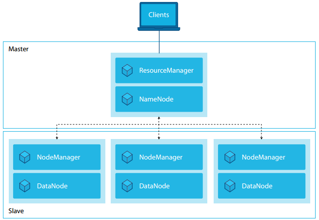
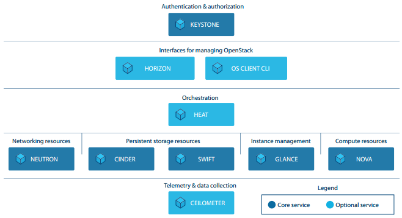
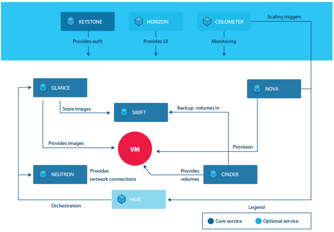
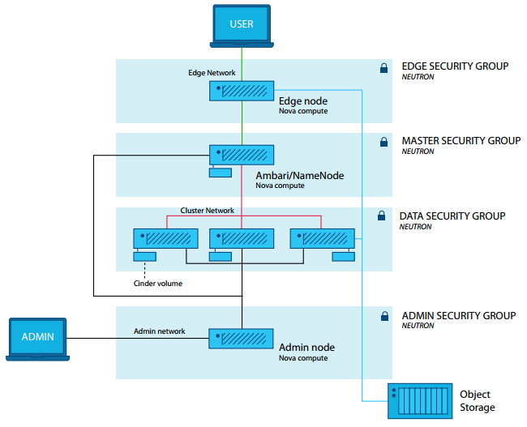

OpenStack Workload Reference Architecture: Big Data
===================================================

Introduction
------------

Big Data analytics has established itself as an important process to support
new or enhanced business models. Big Data is a term for data sets that are so
large or complex that traditional data processing applications are inadequate
to deal with them. Big Data analytics refers to the use of predictive
analytics, user behavior analytics, or certain other advanced data analytics
methods that extract value from data.

Since Big Data analytics can include and analyze all types of data sources,
the results are valuable for most departments in an enterprise. Each might
perform analytics with different business objectives. Considering the short
innovation cycle of most digital business models, Enterprise IT is often
under pressure to fulfill a multitude of demands quickly. A flexible, fast,
efficient and easy-to-manage Big Data deployment is critical.

Cloud is one approach to tackle the dynamic situation caused by high volumes
of analytics requests with rapid deployment time requirements. In an
OpenStack-based cloud environment, a Big Data cluster can be provisioned in
an automated manner. The value of Big Data on cloud contributes to it being
one of the top use cases for OpenStack. According to the April 2016
`OpenStack User Survey`_, 27 percent of users have deployed or are testing
Big Data analytics solutions.

Apache Hadoop on OpenStack offers a Big Data infrastructure that scales out
both compute and storage resources, and provides the secure and automated
capabilities for the analytics process. The `Apache Hadoop project`_ is the
de facto standard open source framework for Big Data analytics, used in the
vast majority of deployments. Multiple Hadoop clusters are often deployed to
respond to an enterprise’s needs.

This reference architecture is intended for enterprise architects who are
looking to deploy Big Data Hadoop clusters on an OpenStack cloud. It describes
a generic Hadoop architecture and uses open source technologies:

* `OpenStack cloud software`_

* `Ubuntu Linux`_ operating system

* `Apache Ambari`_ – open source software to provision, manage and monitor
  Hadoop clusters.

.. _OpenStack User Survey: https://www.openstack.org/assets/survey/April-2016-User-Survey-Report.pdf
.. _Apache Hadoop project: http://hadoop.apache.org/
.. _OpenStack cloud software: http://www.openstack.org/software/
.. _Ubuntu Linux: https://www.ubuntu.com/
.. _Apache Ambari: http://ambari.apache.org/

This reference architecture describes and includes installation files for a
basic Hadoop cluster. Additional services can be applied for a more complex
configuration and will be covered in future works.

Figure 1: High-level overview of Hadoop architecture

OpenStack for Hadoop Clusters
-----------------------------

This Hadoop architecture is derived from actual use cases and experience.
Building a Hadoop-based Big Data environment can be a complex task. It is
highly recommended to use common approaches to reduce this complexity, such as
identifying the data processing models. These processing models demand high
availability of resources, networking, bandwidth, storage, as well as security
constraints in the enterprise context.

* **Batch processing model** – Analytics based on historic data

  In the batch processing model, the analytic tasks are executed or queried in
  a scheduled or recurring manner. Typically the data is already available for
  analysis in a static repository such as large files or databases. The batch
  processing model is often used to analyze business data of a certain period.
  One example is an ETL (extract, transform, load) process to extract business
  data from various ERP systems for supply chain planning.

* **Stream processing model** – Business real-time analytics

  In the stream processing model, data is continuously streamed and directly
  analyzed in real time. Actions can be triggered in case of occurrence of
  special or defined events. An example of a stream processing workload is
  fraud detection for credit card companies. A credit card transaction is
  transmitted online to the credit card company and is evaluated in real time
  based on certain parameters; for example, checking the card’s validity and
  the purchase amount against the limit. It is also possible to check the
  location of purchases and compare this to other recent purchases.
  For example, if purchases are made in the U.S. and Europe in a timespan of
  only a few hours, this indicates a high likelihood of fraud and action can be
  taken to decline the transaction.

* **Predictive processing model** – Predict outcome based on recent and
  historical data

  This model is used to predict an outcome, behavior or other actions for the
  future. Generally this analytic model consists of various predictive
  algorithms. One example is predictive maintenance. Data from machines,
  engines or other sensors is collected and analyzed so that predictive actions
  can be made to recommend the next maintenance cycle before a failure might
  occur.

Hadoop clusters use a master-slave architecture. The data is ingested into the
cluster and stored in blocks in the Hadoop distributed file system (HDFS). The
default block size is 64MB. The blocks of data are replicated to different
nodes in the clusters. Part of the core Hadoop project, `YARN`_ provides a
framework for job scheduling and cluster resource management. With YARN,
multiple data processing applications can be implemented in the Hadoop cluster.

.. _YARN: http://hortonworks.com/apache/yarn/

Typically a Hadoop cluster with YARN is composed of different types of cluster
nodes:

* **NameNode** – The metadata about the data blocks are stored in the NameNode.
  This provides lookup functionality and tracking for all data or files in the
  Hadoop cluster. NameNode does not store the actual data. Generally the
  NameNode requires high memory (RAM) allocation. The NameNode belongs to the
  "master" part of Hadoop architecture.

* **DataNode** – This is also referred as the worker node and belongs to the
  "slave" part of a Hadoop architecture. It is responsible for storing and
  computing the data and responds to the NameNode for filesystem operations.
  Generally a DataNode requires high amount of storage space.

* **ResourceManager** – This is the master that manages the resources in the
  Hadoop cluster. It has a scheduler to allocate resources to the various
  applications across the cluster.

* **NodeManager** – This takes instruction from the ResourceManager and is
  responsible for executing the applications. It monitors and reports the
  resources (cpu, memory, disk) to the ResourceManager.

An OpenStack cloud is powered by many different services (also known as
projects). Utilizing the core services and the Hadoop Common package, a
Hadoop cluster can be deployed in a virtualized environment with minimal
effort. Optional services such as the OpenStack Orchestration service (Heat)
can be added to automate deployment. This reference architecture does not
cover OpenStack Big Data Service (Sahara). Sahara provides a simple means to
provision as well as scale previously provisioned Hadoop clusters.
Sahara will be covered in future reference architecture documents.

Figure 2 shows the core and optional services in relation to one another,
and the services to confirm are available in your OpenStack cloud.

Figure 2. Logical representation of OpenStack services in support of Hadoop
clusters

Brief descriptions of the core and optional services are as follow.
The `OpenStack Project Navigator`_ provides additional information.

.. _OpenStack Project Navigator: http://www.openstack.org/software/project-navigator/

.. list-table:: **Core services**
   :widths: 20 50

   * - Compute (Nova)
     - Manages the life cycle of compute instances, including spawning,
       scheduling, and decommissioning of virtual machines (VMs) on demand.
   * - Image Service (Glance)
     - Stores and retrieves VM disk images. Used by OpenStack Compute during
       instance provisioning.
   * - Block Storage (Cinder)
     - Virtualizes the management of block storage devices and provides a
       self-service API to request and use those resources regardless of the
       physical storage location or device type. Supports popular storage
       devices.
   * - Networking (Neutron)
     - Enables network connectivity as a service for other OpenStack services,
       such as OpenStack Compute. Provides an API to define networks and their
       attachments. Supports popular networking vendors and technologies. Also
       provides LBaaS and Firewall-as-a-Service (FWaaS).
   * - Identity Service (Keystone)
     - Provides authentication and authorization for the other OpenStack
       services.
   * - Object Storage (Swift)
     - Stores and retrieves arbitrary unstructured data objects via a RESTful
       HTTP-based API. Highly fault-tolerant with data replication and
       scale-out architecture.

.. list-table:: **Optional services**
   :widths: 20 50

   * - Orchestration (Heat)
     - Orchestrates multiple composite cloud applications by using either the
       native HOT template format or the AWS CloudFormation template format,
       through both an OpenStack-native REST API and a
       CloudFormation-compatible Query API.
   * - Telemetry (Ceilometer)
     - Monitors and meters the OpenStack cloud for billing, benchmarking,
       scalability, and statistical purposes.
   * - Dashboard (Horizon)
     - Provides an extensible web-based self-service portal to interact with
       underlying OpenStack services, such as launching an instance, assigning
       IP addresses, or configuring access controls.

Figure 3 illustrates the basic functional interaction between these services.
For further details:
`OpenStack Conceptual Architecture Diagram <http://docs.openstack.org/admin-guide/common/get-started-conceptual-architecture.html>`_.

Figure 3. Functional interaction between OpenStack components

Structuring a Hadoop Cluster with OpenStack
-------------------------------------------

OpenStack provides the necessary compute, network and data storage services
for building a cloudbased Hadoop cluster to meet the needs of the various
processing models.

Networking
**********

Multiple networks can be created for the Hadoop cluster connectivity. Neutron
routers are created to route the traffic between networks.

* **Edge Network** – Provides connectivity to the client-facing and enterprise
  IT network. End users are accessing the Hadoop cluster through this network.

* **Cluster Network** – Provides inter-node communication for the Hadoop
  cluster.

* **Management Network** – Optionally provides a dedicated network for
  accessing the Hadoop nodes' operating system for maintenance and monitoring
  purposes.

* **Data Network** – Provides a dedicated network for accessing the object
  storage within an OpenStack Swift environment or to an external object
  storage such as Amazon S3. This is optional if object storage is not used.

Neutron security groups are used to filter traffic. Hadoop uses different
ports and protocols depending on the services deployed and communications
requirements. Different security groups can be created for different types of
nodes, depending on the Hadoop services running on it. With OpenStack security
groups, multiple rules can be specified that allow/deny traffic from certain
protocols, ports, or IP addresses or ranges. Each virtual machine (VM) can be
applied with one or more security groups. In OpenStack, each tenant has a
default security group, which is applied to instances that have no other
security group defined. Unless changed, this security group denies all
incoming traffic.

Image Management
****************

There are multiple options to provide operating system configuration for the
Hadoop nodes. On-the-fly configuration allows greater flexibility but can
increase spawning time. The operating system images can also be pre-configured
to contain all of the Hadoop-related packages required for the different types
of nodes. Pre-configuration can reduce instance build time, but includes its
own set of problems, such as patching and image lifecycle management. In this
example, the Heat orchestration features are used to configure the Hadoop
nodes on-the-fly. Additional Hadoop and operating system packages are installed
on-the-fly depending on the node type (e.g. NameNode, DataNode). These packages
can be downloaded from Internet-based or local repositories. For a more secure
enterprise environment, local package repository is recommended.

Data Management
***************

Similar to an external hard drive, Cinder volumes are persistent block-storage
virtual devices that may be mounted and dismounted from the VM. Cinder volumes
can be attached to only one instance at a time. A Cinder volume is attached to
each Hadoop DataNode to provide the HDFS.

If the data to be processed by a Hadoop cluster needs to be accessed by other
applications, the OpenStack Swift object storage can be used to store it.
Swift offers a cost-effective way of storing unstructured data. Hadoop provides
a built-in interface to access Swift or AWS S3 object storage; either can be
configured to serve data over HTTP to the Hadoop cluster.

Orchestration
*************

Heat uses template files to automate the deployment of complex cloud
environments. Orchestration is more than just standing up virtual servers;
it can also be used to install software, apply patches, configure networking
and security, and more. Heat templates are provided with this reference
architecture that allow the user to quickly and automatically setup and
configure a Hadoop cluster for different data processing models
(types of analytics).

Figure 4: A Hadoop cluster on OpenStack

Demonstration and Sample Code
-----------------------------

This section describes the Heat template provided for this workload. The
template is used to configure all of the Hadoop nodes. It has been created
for reference and training and is not intended to be used unmodified in a
production environment.

An Ambari Hadoop environment is created on a standard Ubuntu 14.04 server
cloud image in QEMU copy on write (qcow2). The qcow2 cloud image is stored in
the Glance repository. The Apache Ambari open source project makes Hadoop
management simpler by providing an easy-to-use Hadoop management web UI backed
by its RESTful APIs. Basically, Ambari is the central management service
for open source Hadoop. In this architecture, an Ambari service is installed
on the Master Node (NameNode). The Heat template also installs additional
required services such as the name server, Network Time Protocol (NTP) server,
database, and the operating system configuration customization required for
Ambari. Floating IP can be allocated to the Master Node to provide user access
to the Ambari service. In addition, an Ambari agent service is deployed on
each node of the cluster. This provides communication and authentication
functionality between the cluster nodes.

The following nodes are installed by the Heat template:

* **Master Node (NameNode)** – This node houses the cluster-wide management
  services that provide the internal functionality to manage the Hadoop cluster
  and its resources.

* **Data Nodes** – Services used for managing and analyzing the data, stored in
  HDFS, are located on these nodes. Analytics jobs access and compute the data
  on the Data Nodes.

* **Edge Node** – Services used to access the cluster environment or the data
  outside the cluster are on this node. For security, direct user access to the
  Hadoop cluster should be minimized. Users can access the cluster via the
  command line interface (CLI) from the Edge Node. All data-import and
  data-export processes can be channeled on one or more Edge Nodes.

* **Admin Node** – Used for system-wide administration

Multiple networks (edge, cluster, management, data) described in previous
sections are created by the Heat orchestration. A Neutron security group
is attached to each instance of the cluster node. The template also provisions
Cinder volumes and attaches one Cinder volume to each node. Swift is not
configured in this template and will be covered in future work.

The Heat template, BigData.yaml, can be downloaded from
http://www.openstack.org/software/sample-configs/#big-data.
Please review the README file for further details.

Scope and Assumptions
---------------------

The Heat template provided for this reference architecture assumes that the
Hadoop cluster workload is deployed in a single-region, single-zone OpenStack
environment. The deployment in a multi-zone/multiregion environment is outside
the scope of this document.

The Heat template is configured to address the minimum infrastructure
resources for deploying a Hadoop cluster. Architecting a Hadoop cluster is
highly dependent on the data volume and other performance indicators defined by
the business use cases, such as response times for analytic processes and how
and which services will be used.

The sample environment uses the Java environment. As such, the Heat template
installer will be required to accept the Java license agreement.

As mentioned, Sahara is not used in this implementation. Sahara is the
OpenStack Big Data Service that provisions a data-intensive application cluster
such as Hadoop or Spark. The Sahara project enables users to easily provision
and manage clusters with Hadoop and other data processing frameworks on
OpenStack. An update to this reference architecture to include Sahara is under
consideration.

Summary
-------

There are many possible choices or strategies for deploying a Hadoop cluster
and there are many possible variations in OpenStack deployment. This document
and the accompanying Heat templates serve as a general reference architecture
for a basic deployment and installation process via Openstack orchestration.
They are intended to demonstrate how easily and quickly a Hadoop Cluster can be
deployed, using the core OpenStack services. Complementary services will be
included in future updates.

These additional resources are recommended to delve into more depth on overall
OpenStack cloud architecture, the OpenStack services covered in this reference
architecture, and Hadoop and Ambari. The vibrant, global OpenStack community
and ecosystem can be invaluable for their experience and advice, especially the
users that have deployed Big Data solutions. Visit openstack.org to get started
or click on these resources to begin designing your OpenStack-based Big Data
analytics system.

.. list-table::
   :widths: 25 50
   :header-rows: 1

   * - Resource
     - Overview
   * - `OpenStack Marketplace`_
     - One-stop resource to the skilled global ecosystem for distributions,
       drivers, training, services and more.
   * - `OpenStack Architecture Design Guide`_
     - Guidelines for designing an OpenStack cloud architecture for common use
       cases. With examples.
   * - `OpenStack Networking Guide`_
     - How to deploy and manage OpenStack Networking (Neutron).
   * - `OpenStack Virtual Machine Image Guide`_
     - This guide describes how to obtain, create, and modify virtual machine
       images that are compatible with OpenStack.
   * - `Complete OpenStack documentation`_
     - Index to all documentation, for every role and step in planning and
       operating an OpenStack cloud.
   * - `Community Application Catalog`_
     - Download this LAMP/WordPress sample application and other free
       OpenStack applications here.
   * - `Apache Hadoop project`_
     - The de facto standard open source framework for Big Data analytics,
       used in this reference architecture.
   * - `Apache Ambari project`_
     - This reference architecture and files deploy Big Data using Ambari, an
       open source package for installing, configuring and managing a Hadoop
       cluster.
   * - `Welcome to the community!`_
     - Join mailing lists and IRC chat channels, find jobs and events, access
       the source code and more.
   * - `User groups`_
     - Find a user group near you, attend meetups and hackathons—or organize
       one!
   * - `OpenStack events`_
     - Global schedule of events including the popular OpenStack Summits and
       regional OpenStack Days.

.. _OpenStack Marketplace: http://www.openstack.org/marketplace/
.. _OpenStack Architecture Design Guide: http://docs.openstack.org/arch-design/
.. _OpenStack Networking Guide: http://docs.openstack.org/mitaka/networking-guide/
.. _OpenStack Virtual Machine Image Guide: http://docs.openstack.org/image-guide/
.. _Complete OpenStack Documentation: http://docs.openstack.org/
.. _Community Application Catalog: http://apps.openstack.org/
.. _Apache Ambari project: http://ambari.apache.org/
.. _Welcome to the community!: http://www.openstack.org/community/
.. _User groups: https://groups.openstack.org/
.. _OpenStack events: http://www.openstack.org/community/events/
